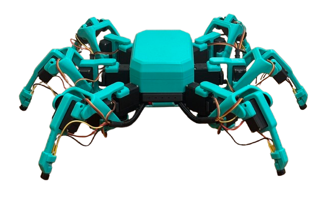

## Nice to see you! I'm Angus 👋

I'm in my final semester of uni studying mechatronic engineering and computer science, and have just kicked off my six-month industry placement as a software engineer at [@Accenture](https://github.com/accenture)! 🎉

I'm endlessly fascinated by robotics, bridging computing and the real world is a marvel that just doesn't get old. So I'm excited to announce I've finally built my first legged robot ["Minty"](https://github.com/sram8836/minty-the-hexapod). I promise he's a lot friendly than he looks!

  

## Programming Languages

-

## Stack Experience

